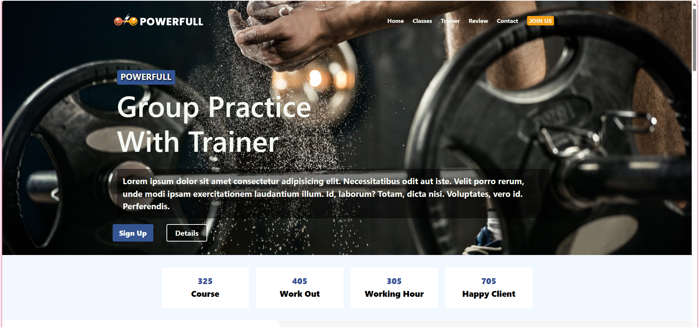

# 🏋️ Sport Center Website
This project includes the design of an interactive and user-friendly website for a sports center. It is created using HTML, CSS and JavaScript. The purpose of the project is to introduce various services to sports center clients and facilitate effective communication.

## 📋 Features
* Active Buttons:

 The buttons under "Our Classes" section are interactive elements that introduce various sports branches to the user. There is an image for each sports branch.

* Hover Preview: 

The last image in the "Our Best Trainers" section provides a hover preview when hovered over other content. This feature allows users to examine trainers more closely.

* BMI Calculator:

 The BMI calculator allows users to calculate their body mass indexes by entering weight and height information. This calculation can help determine health and fitness goals.

* Navbar Links:

The links on the navbar are linked to the relevant sections via "id", providing easy navigation for the user.

* Fixed Navbar:

 As the page is scrolled, the navbar is fixed at the top of the screen and is always accessible to the user. The background color is set to #355592.

* Google Maps: 

The Google Map in the "Contact" section shows users the location of the sports center and provides an interactive map experience.

* Responsive Design: 

The design is optimized for viewing on mobile devices with a screen width of 576px.

## 🛠️  Installation 

* Clone the repository.
* Navigate to the project directory.
* You can run the project on ' localhost:5173 ' by typing ' npm run dev ' in the terminal.

## 📸 Screenshots

